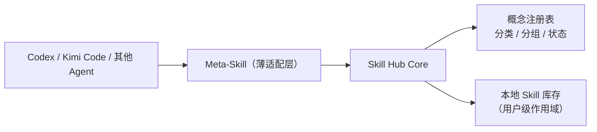

# Skill Hub

面向 Codex、Kimi Code 与其他支持 Agent Skills 的客户端的、Agent 无关的 Skill 管理平台。

> 当前状态：产品定义阶段。本文档描述的是目标架构与功能边界，不代表已实现的功能。

## 解决什么问题

常用多个 coding agent（如 Codex、Kimi Code）的用户，Skill 分散在各 Agent 自己的目录里；随着数量增长，会频繁需要新增、维护、删除、禁用、分类、分组。已有方案大多是「外部工具管 Skill」——独立的桌面应用、CLI 包管理器或云端注册表——Skill 的创建和维护要离开对话上下文。

Skill Hub 换一个方向：**平台本身作为一个 Meta-Skill 注册进各 Agent**，在对话里直接提供新增、更新 Skill 的元能力；同时用一个与 Agent 无关的核心集中维护 Skill 的概念、分类与状态。



各 Agent 只安装薄适配层（Meta-Skill）；真正的创建、更新、禁用、分类逻辑都在 Core 里，不随 Agent 聊天记录丢失。

## 核心概念

- **Meta-Skill**：注册进每个 Agent 的管理入口。在对话中让 Agent 新增、更新、查看 Skill，无需离开会话。
- **概念注册表**：集中维护「生成 Skill 的核心概念」——Skill 的 anatomy、frontmatter 约定、触发描述写法等，是平台生成和审核 Skill 的事实来源。
- **统一管理面**：查看、删除、禁用、分类、分组。禁用不删除文件，只是从 Agent 的发现路径中摘除。
- **用户级作用域**：Skill 默认注册到用户级域（如 `~/.agents/skills`），对所有项目全局生效；项目级注册作为可选能力。
- **本地优先**：状态保存在本地文件，不把聊天记录当作唯一存储。

## 与现有方案的区别

| 项目 | 形态 | 与 Skill Hub 的差异 |
|---|---|---|
| [mode-io/skill-manager](https://github.com/mode-io/skill-manager) | 独立本地 app | 外部管理器，无 Agent 内驻 Meta-Skill；不支持 Kimi Code |
| [yibie/skills-manager](https://github.com/yibie/skills-manager) | macOS app + TUI | 外部管理器，无概念注册表 |
| [vercel-labs/skills](https://github.com/vercel-labs/skills) (`npx skills`) | 包管理器 CLI | 只负责安装/删除，无禁用、分类、分组管理 |
| [Portkey Skills Registry](https://portkey.ai/blog/skills-registry/) | 云端团队注册表 | 面向团队分发，非本地个人管理 |
| 各类 Marketplace（LobeHub 等） | 发现与分发 | 不做本地生命周期管理 |

## 仓库结构（规划）

```text
packages/core/            Skill 模型、概念注册表、分类/分组/状态逻辑
packages/cli/             面向用户和脚本的 CLI
meta-skill/               注册进各 Agent 的 Meta-Skill 定义
adapters/codex/           Codex 薄适配层
adapters/kimi-code/       Kimi Code 薄适配层
docs/                     产品与架构文档
```

## 公开仓库安全规则

- 永不提交真实的用户 Skill 内容、本地路径中的隐私信息或任何凭据。
- 示例中的路径与配置一律使用占位符。

## 许可证

MIT。各 Agent 平台与其 Skill 格式仍受各自条款约束。
