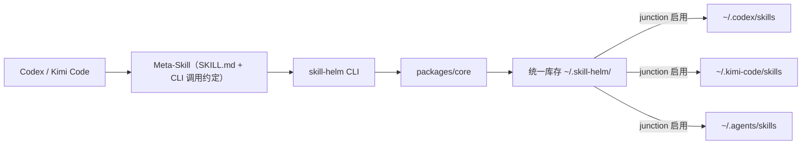

# Skill Helm 实现方案（评审稿）

> 状态：待评审。本文档是写代码前的方案约定，评审通过后作为 M0 的实施依据。

## 1. 目标与范围

**M0 目标**：在本机（Windows 优先）建立「一个库存、多处启用」的 Skill 管理闭环，并以 Meta-Skill 形式注册进 Codex 与 Kimi Code，让用户在对话中完成 Skill 的新增、更新、查看、禁用、分类、分组。

**M0 不做**：

- 持久化接口（见 [issue #1](https://github.com/coconilu/skill-helm/issues/1)，M2）
- 市场搜索（见 [issue #2](https://github.com/coconilu/skill-helm/issues/2)，M3）
- 图形界面、云端同步、多设备合并
- Linux/macOS 适配（设计上不封堵，但不验证）

## 2. 本机事实（2026-08 实测）

| Agent | 用户级 Skill 目录 |
|---|---|
| Codex | `~/.codex/skills/` |
| Kimi Code | `~/.kimi-code/skills/` |
| 共享（多 Agent 共读） | `~/.agents/skills/` |

现状问题：同一 Skill（如 hyperframes 系列）在 `~/.codex/skills` 与 `~/.agents/skills` 重复维护多份副本，更新时需要逐处同步。

## 3. 总体架构



- **统一库存**：每个 Skill 只在 `~/.skill-helm/skills/<name>/` 保存一份权威副本。
- **启用 = 目录联接（junction）**：启用即把库存目录联接到目标 Agent 的 skills 目录；禁用即移除联接。文件本体不动，删除才清理库存。
- **薄适配层**：每个 Agent 只是一个声明（skills 目录路径 + 联接策略），不含业务逻辑。

## 4. 仓库结构（M0 落地）

```text
packages/core/      Skill 模型、frontmatter 解析、库存读写、registry.json、启用/禁用、收编
packages/cli/       skill-helm 命令行（人用 + Agent 用，--json 输出）
meta-skill/         SKILL.md，教 Agent 用 CLI 完成 Skill 管理；本身也由库存管理
adapters/
  codex.json        { "skillsDir": "~/.codex/skills" }
  kimi-code.json    { "skillsDir": "~/.kimi-code/skills" }
  agents-shared.json{ "skillsDir": "~/.agents/skills" }
concepts/           概念注册表（见第 6 节）
docs/
```

技术选型：TypeScript + Node.js 22 + pnpm monorepo（与 token-plan-media-hub 一致）；零外部服务依赖；测试用 vitest。

## 5. 数据模型

`~/.skill-helm/` 布局：

```text
~/.skill-helm/
  skills/<name>/        权威副本（SKILL.md + 附属文件）
  registry.json         元数据（唯一状态入口）
  concepts/             从仓库 concepts/ 同步的概念注册表副本
```

`registry.json` 示例：

```json
{
  "version": 1,
  "skills": {
    "video-understanding": {
      "status": "enabled",
      "enabledIn": ["kimi-code"],
      "categories": ["media"],
      "groups": ["video"],
      "tags": ["youtube", "bilibili"],
      "source": "local",
      "createdAt": "2026-08-24T00:00:00Z",
      "updatedAt": "2026-08-24T00:00:00Z"
    }
  },
  "categories": { "media": { "description": "音视频处理" } },
  "groups": { "video": { "description": "视频相关", "categories": ["media"] } }
}
```

约束：

- Skill 的**事实状态** = 库存目录存在 + junction 存在；`registry.json` 是元数据与意图记录。CLI 每次执行前做一致性校验（漂移则提示 `doctor` 修复）。
- 同名 Skill 已存在于多个 Agent 目录时，`adopt` 以指定目录为权威副本，其余目录在确认后替换为 junction。

## 6. 概念注册表

`concepts/` 是「如何生成一个合格 Skill」的事实来源，Markdown 形式、随仓库版本化：

- `anatomy.md` —— Skill 的目录结构、SKILL.md 必备要素
- `frontmatter.md` —— name / description / 触发条件写法约定
- `description-writing.md` —— 触发描述怎么写才被 Agent 正确发现
- `naming.md` —— 命名规范（小写连字符、动词开头等）

用途：① `create` 按此生成模板；② `lint` 按此校验；③ Meta-Skill 指导 Agent 改 Skill 时引用。同步方式：CLI 首次运行或 `concepts sync` 时复制到 `~/.skill-helm/concepts/`。

## 7. CLI 命令面（M0）

| 命令 | 说明 |
|---|---|
| `list [--json] [--category c] [--group g] [--status s]` | 查看库存（默认表格） |
| `show <name>` | 查看单个 Skill 详情与启用位置 |
| `create <name> --description "..." [--category c]` | 按概念注册表生成模板并入库 |
| `update <name>` | 更新描述/元数据（内容编辑交给调用方/Agent） |
| `adopt <path> [--name n] [--from agent]` | 收编已有 Skill 进库存，原位置替换为 junction |
| `enable <name> --to codex,kimi-code` | 启用到指定 Agent |
| `disable <name> --from codex` | 禁用（移除 junction，保留文件） |
| `rm <name>` | 从库存删除（先要求全部禁用） |
| `categorize <name> --set a,b` / `group <name> --set g` | 分类 / 分组 |
| `concepts list` / `concepts show <topic>` | 查看概念注册表 |
| `lint <name>` | 按概念注册表校验 |
| `doctor` | 一致性校验与修复（漂移 junction、registry 缺项） |

所有命令支持 `--json`，stderr 给人看的解释，stdout 给结构化结果——Meta-Skill 与脚本只依赖 stdout。

## 8. Meta-Skill

`meta-skill/SKILL.md` 要点：

- name: `skill-helm`，description 覆盖「创建/管理/整理 skill」类触发语
- 约定 Agent 通过 `skill-helm <cmd> --json` 完成操作，**不直接手写文件进各 Agent 目录**
- 创建新 Skill 的流程：读 `concepts` → `create` 生成模板 → 填写内容 → `lint` → `enable`
- 安装方式：`skill-helm` 本身作为一个 Skill 收编进库存（自举），默认启用到所有已检测到的 Agent

## 9. 里程碑

| 里程碑 | 内容 | 验收 | 状态 |
|---|---|---|---|
| M0 | core + cli + 3 个 adapter + meta-skill + adopt | 收编本机现有 Skill；在 Codex/Kimi 对话中创建并启用一个新 Skill | ✅ 已完成 |
| M1 | concepts 完善 + lint 规则 + doctor | 存量 Skill 全部通过 lint 或有明确豁免 | ✅ 已完成（2026-08-25） |
| M2 | 持久化接口（issue #1） | 可选接入空项目记录历史 | ✅ 已完成（2026-08-25，history 命令） |
| M3 | 市场搜索（issue #2） | 按描述搜索、罗列、下载、试用 | ✅ 已完成（2026-08-25，search/install 命令） |
| M4 | Tauri 桌面端可视化管理 | 图形界面复用 packages/core，完成查看/启停/收编/搜索 | 🚧 实施中（2026-08-25，issue #3） |

> M4 实现说明（2026-08-25）：
>
> - 架构沿用 token-plan-media-hub 已验证的模式：`skill-helm serve`（packages/cli，Node HTTP API，仅回环，启动写 `~/.skill-helm/server.json`）+ Tauri 壳（Rust 拉起 sidecar、读 origin、退出时按进程树清理）+ React 仪表盘（apps/desktop，Vite 构建）。
> - 仪表盘三页：技能（筛选 / 启停 chip / 收编 / 详情抽屉含编辑、lint、删除）、市场（搜索 / 候选 / 安装）、历史（时间线或未启用引导）。
> - API 契约：`/api/meta` `/api/skills` `/api/skills/:name[/update|/enable|/disable]` `/api/adopt` `/api/search` `/api/install` `/api/doctor` `/api/history` `/api/concepts`，与 CLI 共用同一 core。
> - 非 Tauri 调试：`VITE_API_ORIGIN=http://127.0.0.1:<port> pnpm --dir apps/desktop dev`。

> 状态更新：M1–M3 于 2026-08-25 实现。M2 落地形式为 `history` 命令 + `~/.skill-helm/config.json` 可选配置；M3 落地形式为 `search`（GitHub 仓库搜索）+ `install`（tar.gz 下载扫描入库），试用 = enable / 清理 = disable + rm。

## 10. 风险与开放问题

1. **junction 与 Agent 的兼容性**：需实测 Codex / Kimi Code 是否能正常发现 junction 指向的 Skill（mode-io 已验证 Codex 可行，Kimi Code 待验）。若不行，回退方案是复制 + `doctor` 同步。
2. **收编冲突**：同一 Skill 多份副本内容可能已有分歧，adopt 需要 diff 提示，不能静默覆盖。
3. **registry.json 并发**：多个 Agent 会话同时操作时可能竞争写入。M0 用原子写（临时文件 + rename）+ 文件锁，不做更复杂的方案。
4. **共享目录 `~/.agents/skills` 的定位**：它本身是「一处管理、多 Agent 共读」的现成机制。Skill Helm 是否还应向各 Agent 目录分别联接，还是优先统一收敛到 `~/.agents/skills`？**这一点请评审时重点拍板**（见下）。

## 11. 评审决策点

1. 目录策略：A. 各 Agent 目录分别 junction（兼容只读自己目录的 Agent）；B. 统一收敛到 `~/.agents/skills`（更简单，但依赖 Agent 支持共读该目录）。倾向 A，B 作为可配置的简化模式。
2. 技术栈确认：TypeScript + pnpm monorepo，还是更轻的单包 Node CLI？
3. M0 是否包含 `adopt`？（不含则存量 Skill 无法纳入管理，倾向包含。）
4. 概念注册表放在仓库 `concepts/` 同步到本地，还是直接以 `~/.skill-helm/concepts/` 为权威？倾向前者（版本化、可评审）。
